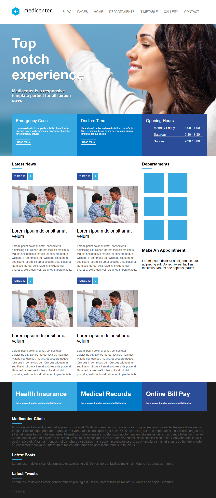

# 🏥 MediCenter - Projeto de Website Responsivo



> Template de clínica médica responsivo desenvolvido com HTML5 e CSS3, utilizando **Flexbox** como principal técnica de layout.

---

## Descrição

O **MediCenter** é um projeto de website responsivo para uma clínica médica fictícia. A página foi construída do zero utilizando HTML e CSS puro, focando em boas práticas de estruturação, semântica e responsividade.

---

##  Tecnologias e Técnicas Utilizadas

###  HTML5
- Estrutura semântica com uso de `header`, `section`, `aside`, `article` e `footer`.
- Utilização de listas para menus (`ul > li`).
- Sistema de grid baseado em seções flexíveis.

###  CSS3 com Flexbox
- **Layout principal** estruturado com `display: flex` para alinhar elementos horizontal e verticalmente (`container`, `header`, `footer`, etc.).
- Uso de `flex-direction: column` e `flex-wrap: wrap` para garantir adaptabilidade em diferentes tamanhos de tela.
- Sistema de colunas com `flex: 1`, permitindo divisão proporcional entre seções.
- Menu de navegação e rodapé com alinhamento dinâmico e responsivo.
- Estilização condicional via `hover` e `.active`.

###  Responsividade
- O layout se adapta bem a diferentes resoluções usando:
  - `flex-wrap` para empilhar elementos em telas menores.
  - `max-width`, `min-width`, `width: 100%` para controle fluido.
  - `background-size: cover` e `background-position: center` para imagens de fundo responsivas.

###  Estética e Design
- Paleta de cores institucional com tons de azul (#39aae1, #0079c7, #2b4c99).
- Tipografia padronizada com **Arial**.
- Imagens ilustrativas e placeholders estilizados para simular conteúdo real.
- Sombreamento e espaçamento coerentes para legibilidade e clareza visual.

---

## Estrutura de Arquivos

```
/assets
  /css
    style.css
  /images
    logo.png
    dr.jpg
index.html
README.md
medicenter.png
```

---

##  Funcionalidades Implementadas

- Cabeçalho com menu navegável.
- Banner principal com imagem de fundo e três blocos de informação.
- Seção de notícias recentes com layout em grid flexível.
- Área lateral com departamentos e formulário fictício de agendamento.
- Rodapé dividido em três blocos, seguido por uma área informativa e direitos autorais.

---

##  Aprendizados

Este projeto reforçou conceitos importantes como:

- A criação de **layouts fluidos com Flexbox**.
- Separação de preocupações entre estrutura (HTML) e estilo (CSS).
- Importância da responsividade para dispositivos móveis.
- Boas práticas de organização de código e semântica.

---

##  Screenshot


---

## Como Visualizar

1. Clone o repositório:
   ```bash
   git clone https://github.com/seu-usuario/medicenter.git
   ```
2. Abra o arquivo `index.html` em qualquer navegador.

---
